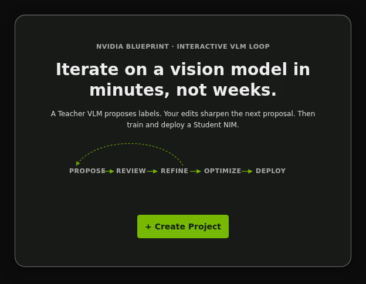
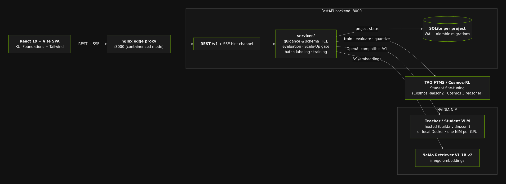

# NVIDIA AI Blueprint: Interactive VLM Feedback Loop

[](LICENSE)
[](https://www.python.org/)
[](https://react.dev/)

Build an image-labeling workflow in which expert corrections improve the next
Vision Language Model (VLM) request immediately, then measure when the workflow
is ready for batch labeling and optional Student-model training.



This repository is an open reference application that integrates NVIDIA NIM,
NVIDIA NeMo Retriever, and NVIDIA TAO. It includes a working web UI, API,
evaluation and readiness logic, a bundled sample dataset, and both container
and source deployment paths.

> [!WARNING]
> This is a single-user reference application with no authentication,
> authorization, or multi-user isolation. It binds to `127.0.0.1` by default.
> Do not expose it directly to the public internet. Remote access requires a
> trusted network and an operator-managed authenticated proxy or equivalent
> access-control layer.

## Table of contents

- [Overview](#overview)
- [Why this Blueprint](#why-this-blueprint)
- [How it works](#how-it-works)
- [Key features](#key-features)
- [Architecture](#architecture)
- [Software components](#software-components)
- [Target audience](#target-audience)
- [Requirements](#requirements)
- [Data handling, cost, and limitations](#data-handling-cost-and-limitations)
- [Get started](#get-started)
- [Deployment options](#deployment-options)
- [Configuration and data](#configuration-and-data)
- [API and development](#api-and-development)
- [Documentation](#documentation)
- [Contributing and security](#contributing-and-security)
- [License](#license)

## Overview

Most vision projects are slowed down by the cost of producing reliable labels
and the delay between finding a model error and improving the workflow. The
Interactive VLM Feedback Loop puts a Subject Matter Expert (SME) directly in
that loop:

1. A Teacher VLM proposes a structured label for an image.
2. The SME accepts it, corrects it, skips the image, or retries with different
   Guidance or a different Teacher.
3. Accepted and corrected labels become Verified ground truth.
4. Verified corrections can be selected as In-Context Learning (ICL) examples
   for later Teacher requests.
5. Held-out evaluation measures quality while the SME continues labeling.
6. A five-criterion Scale-Up Readiness Gate controls Batch Labeling.
7. Optional NVIDIA TAO jobs fine-tune, evaluate, and quantize Student models
   that can be validated behind NVIDIA NIM and compared with the Teacher.

ICL changes the examples sent in later prompts; it does not update the
Teacher's weights. Student fine-tuning is the weight-updating stage. See the
[product overview](docs/Overview.md) for the complete workflow and terminology.

## Why this Blueprint

- **Shorten the correction loop.** An SME correction is immediately eligible
  to guide relevant future proposals.
- **Protect evaluation integrity.** Verified Test Pool examples are held out
  from ICL and synthetic labels never become ground truth automatically.
- **Spend expert time efficiently.** pHash and image embeddings prioritize
  diverse images instead of presenting near-duplicates in sequence.
- **Make scale-up explicit.** Batch Labeling stays locked until the backend's
  readiness criteria pass.
- **Require benchmarkable training data.** Student Training remains independent
  of Teacher-quality metrics but stays locked until both its Verified training
  split and configured held-out Test Pool minimum are available.
- **Keep model decisions inspectable.** Guidance, prompts, labels, evaluation
  snapshots, exports, training jobs, and deployment evidence retain lineage.
- **Support a practical Student path.** The same application prepares
  Cosmos-RL datasets, submits TAO workflows, validates quality, and benchmarks
  serving performance with real held-out images and the production prompt.

## How it works

```text
Ingest images + define Guidance
                |
                v
Teacher VLM proposes a structured label
                |
                v
 SME saves, edits, skips, or retries
        |                    |
        v                    v
 Verified ground truth   Omitted image
        |
        +--> corrected examples become eligible for ICL
        |
        +--> held-out evaluation --> Scale-Up Readiness Gate --> Batch Labeling
        |                             (Teacher quality)          (Auto-Labeled)
        |
        +--> training + Test Pool minimum --> Student Training
             + TAO readiness                 (TAO / Cosmos-RL)
                                                    |
                                                    v
                                         NIM serving validation
                                         + Teacher comparison
```

The backend is authoritative for schema derivation, validation, prompt
construction, ICL selection, evaluation, readiness, pool routing, and job state.
The React UI consumes those contracts through REST; Server-Sent Events (SSE)
provide progress hints, followed by REST reconciliation.

## Key features

- Guided project setup, image ingestion, and versioned task Guidance.
- Structured Core and Aux label fields with backend validation and schema
  evolution rules.
- Hosted or self-hosted Teacher VLM inference through OpenAI-compatible NVIDIA
  NIM endpoints.
- Relevance-ranked ICL from Verified Edits, with token and image-budget
  enforcement.
- Diversity-first review order using a CPU pHash baseline and NVIDIA NeMo
  Retriever VL image embeddings.
- Background held-out evaluation with Exact Match, per-field metrics, pool
  coverage, and regression-aware Returning/New reporting.
- A backend-authoritative five-criterion Scale-Up Readiness Gate.
- Recoverable Batch Labeling, versioned dataset exports, and explicit
  Auto-Labeled lineage.
- Cosmos-RL / NVIDIA TAO Student training, baseline and quantized evaluation,
  Student registration, temporary NIM serving validation, and Teacher/Student
  comparison, followed by a portable NIM deployment bundle with
  checksums, the serving-evaluated structured request template, and
  ready-to-run launch/real-image verification helpers.
- A 15-image rock/paper/scissors sample for the first-run walkthrough.

## Architecture



The Blueprint is a single-repository application with two first-class delivery
modes: local source and Docker Compose. Both use the same FastAPI services and
per-project SQLite model.

Runtime data stays outside the source tree:

```text
{WORKSPACE_ROOT}/
  projects/
    {project_id}/
      project.db
      exports/
      artifacts/
      logs/
```

Images are stored by filesystem reference and are not copied into a project.
SQLite runs in WAL mode, Alembic migrations apply automatically when a project
opens, and background jobs run in-process with `asyncio`; there is no external
task queue. A nonempty database with missing or malformed Alembic revision state
is backed up and refused instead of being guessed to be a fresh project.

## Software components

| Component | Technology | Role |
| --- | --- | --- |
| Web application | React 19, TypeScript, Vite, KUI Foundations, Tailwind 4 | Guided setup, labeling, evaluation, Scale-Up, training, and comparison UI |
| Application API | Python, FastAPI, Pydantic, SQLAlchemy | Authoritative product logic and versioned `/v1` REST API |
| Project storage | SQLite WAL, Alembic | One durable database per project |
| Edge proxy | nginx | Container-mode static serving, REST proxying, and SSE-safe passthrough |
| Teacher and Student inference | NVIDIA NIM | OpenAI-compatible hosted or self-hosted VLM inference |
| Image embeddings | NVIDIA NeMo Retriever VL 1B v2 NIM | Semantic diversity and ICL relevance |
| Student training | NVIDIA TAO FTMS with Cosmos-RL | Fine-tuning, evaluation, and quantization |
| Background work | In-process `asyncio` | Embeddings, evaluation, exports, batch runs, and job monitoring |

## Target audience

| Audience | Start here |
| --- | --- |
| Subject Matter Experts evaluating the labeling loop | [Hosted quick start](#hosted-quick-start) |
| Application developers extending the Blueprint | [Local source quick start](#local-source-quick-start) |
| GPU and NIM operators | [Local NIM setup](docs/local_nim_dev_setup.md) |
| TAO infrastructure operators | [TAO FTMS operator guide](docs/tao-ftms-install.md) |
| API consumers | [API reference](docs/API.md) |

## Requirements

### Deployment requirements

| Profile | Software and credentials | GPU |
| --- | --- | --- |
| Hosted, containerized | Docker Engine with Compose v2; `NVIDIA_API_KEY` | None |
| Hosted, local source | Ubuntu 22.04 LTS (validated); Python 3.11-3.13; Node.js 20+; `uv`; `pnpm` 9+; `NVIDIA_API_KEY` | None |
| Self-hosted local NIM | Local-source requirements plus Docker, NVIDIA Container Toolkit, compatible NVIDIA driver, NGC access, and `NGC_API_KEY` | Model-dependent; see below |
| Student training | Reachable TAO FTMS deployment, TAO credentials, workspace object-store credentials, and `HF_TOKEN` when a gated base requires it | Managed by the TAO deployment |

Docker Compose with hosted endpoints is supported on Linux and through Docker
Desktop on macOS or Windows. System-managed local NIM deployment is Linux-only
and requires local-source mode because the containerized backend intentionally
has no Docker CLI or Docker socket.

### Hardware requirements

Hosted Teacher inference and hosted embeddings require no local GPU. For local
NIMs, the seeded deployment policy uses these memory floors:

| GPU memory | Supported local path |
| --- | --- |
| `>= 24 GB` | NeMo Retriever VL 1B v2 embeddings with a hosted Teacher, on a GPU listed in the NIM 2.0.0 support matrix |
| `>= 36 GB` | Cosmos Reason2 2B Teacher |
| `>= 56 GB` | Cosmos 3 Nano recommended Teacher; Cosmos Reason2 8B also selectable |
| `>= 80 GB` and compute capability `>= 9.0` | Nemotron 3 Nano Omni recommended Teacher |
| `>= 88 GB` | Cosmos 3 Super selectable; seeded deploys clamp the serving context to 65,536 tokens so its 62.6 GiB BF16 checkpoint leaves sufficient KV cache on a 96 GB GPU |

The 24 GB value is an eligibility floor, not a generic compatibility claim:
NVIDIA validates specific GPU SKUs for this embedding model. Automatic setup
recommends local embeddings only when the detected GPU name exactly matches
that pinned matrix and the memory floor fits; unrecognized hardware stays on
hosted embeddings or pHash unless an operator deliberately tests the NIM
fallback path. GPU architecture, precision, driver, NIM release, access terms,
RAM, and disk requirements also apply. Use the
[local NIM hardware matrix](docs/local_nim_dev_setup.md#1-hardware-requirements)
before choosing a GPU host.

The application warms one deployment-scoped environment assessment and reuses
its Docker, NVIDIA Container Toolkit, and GPU inventory snapshot across
projects for the lifetime of the backend process. Credential and active-NIM
state is still read fresh, and every deployment preflight performs live safety
checks. Operators who change host prerequisites without restarting can force a
new snapshot with `GET /v1/environment?refresh_hardware=true`.

### One NIM per GPU

The Blueprint permits at most one local NIM container per GPU, regardless of
what a simple VRAM sum suggests. On multi-GPU systems, placement uses the
lowest compatible free GPU. On a single-GPU system, use one of these profiles:

- local Teacher with pHash diversity;
- local Teacher with hosted embeddings;
- local embeddings with a hosted Teacher; or
- temporary Student benchmarking that displaces and then restores the Teacher.

Replacing a resident NIM requires explicit confirmation. The detailed
placement, reuse, recovery, and replacement contract is in the
[deployment guide](docs/deployment.md#gpu--local-nim-runtime-behavior).

## Data handling, cost, and limitations

Projects store filesystem references to images, not image copies. Data leaves
the Blueprint host in these workflows:

| Workflow | Data sent externally |
| --- | --- |
| Hosted embeddings | Images selected for embedding |
| Hosted Teacher | The current image, selected ICL examples and labels, prompt, and output schema |
| TAO training | Selected training and test images plus annotations uploaded to the configured workspace |

Self-hosted endpoints can also run on another machine. Review each operator's
access, retention, privacy, and model terms before using sensitive data.
Hosted APIs and TAO may incur charges; local NIMs consume GPU resources.

Image reads are restricted by the current `IMAGE_ROOT`. This is a single-user,
trusted-network reference application without built-in authentication or high
availability; run only one backend process per project database. Compose cannot
manage local NIM containers, so use local-source mode for that workflow. See
the [deployment guide](docs/deployment.md) for operational details.

## Get started

### Hosted quick start

This is the recommended first experience. It uses Docker Compose, hosted
NVIDIA endpoints, and the bundled rock/paper/scissors sample. No local GPU is
required.

1. Get an API key from
   [build.nvidia.com](https://build.nvidia.com/settings/api-keys).

2. Clone and launch the Blueprint:

   ```bash
   git clone https://gitlab-master.nvidia.com/NVRetail/vlm-feedback-loop
   cd vlm-feedback-loop
   export NVIDIA_API_KEY=nvapi-...
   docker compose up --build
   ```

3. Open <http://localhost:3000> and select **Create Project**. With the API key
   present, the Blueprint selects the recommended hosted Teacher and hosted
   embedding provider automatically; confirm the defaults if that screen is
   shown. Fresh projects preseed only models whose published model terms permit
   commercial use; the default hosted Teacher is Step 3.7 Flash. The free
   NVIDIA API Catalog endpoint is still for development and evaluation. Before
   a Batch Labeling run uses it, the Blueprint requires a confirmation and
   links the API Trial Terms. For production, configure a subscribed provider
   endpoint or deploy NIM under the appropriate NVIDIA AI Enterprise
   entitlement.

4. **Ingest Images** normally opens the bundled `/data/images` sample. Check
   the `rock`, `paper`, and `scissors` folders, then choose **Ingest Selected**.

5. On **Guidance**, choose the **Rock, paper, scissors** preset, then select
   **Save Guidance**. Saving activates the guidance and opens **Labeling**.

6. Save correct labels, edit genuinely incorrect labels before saving, and
   skip images that cannot be judged. A real Verified Edit becomes eligible
   for a later ICL request unless it is reserved for the Test Pool.

The bundled sample demonstrates the loop but is intentionally too small for
Batch Labeling or Student Training under the default data-readiness settings.
With the default 40% Test Pool allocation, at least 150 ingested and Verified
images are needed to reach the 60-image pool minimum; real applications may
require substantially more.

Stop the stack without deleting project data:

```bash
docker compose down
```

Projects persist in the `vlm-feedback-loop-workspace` Docker volume. See the
[deployment guide](docs/deployment.md#stop-restart-resume-and-reset) for
restart, bind-mount, and reset procedures.

### Local source quick start

Use source mode for development and for system-managed local NIMs:

```bash
git clone https://gitlab-master.nvidia.com/NVRetail/vlm-feedback-loop
cd vlm-feedback-loop

uv sync
cd src/ui && pnpm install && cd ../..

uv run vlm-feedback-loop init --workspace-root ~/vlm-workspace
# Add NVIDIA_API_KEY to ~/.vlm_feedback_loop/.env for hosted endpoints.

./scripts/dev.sh
```

Open <http://localhost:5173>. The backend runs at
<http://localhost:8000>, and Vite proxies REST and SSE requests. Stop with
`Ctrl+C`; rerun `./scripts/dev.sh` to resume from the configured workspace.

## Deployment options

| Mode | Best for | Entry point |
| --- | --- | --- |
| Docker Compose + hosted endpoints | Fast evaluation with no local toolchain or GPU | `docker compose up --build` |
| Local source + hosted endpoints | Development and debugging | `./scripts/dev.sh` |
| Local source + local NIM | GPU-backed Teacher, embeddings, or temporary Student validation | In-app setup after `./scripts/dev.sh` |
| Hybrid | A local Teacher on one GPU with hosted embeddings | In-app setup with both API keys |
| TAO-enabled | Student fine-tuning and quantization | TAO deployment plus `uv run vlm-feedback-loop tao-bootstrap` |

The Compose stack contains nginx, backend, and UI services only. NIM
containers are started at runtime by the source-mode backend with `docker run`;
they are not Compose services. Do not add the Docker socket to the shipped
backend container.

For networking, persistence, GPU behavior, and troubleshooting, use the
[deployment guide](docs/deployment.md).

## Configuration and data

Configuration has three scopes:

1. `~/.vlm_feedback_loop/config.yaml` contains non-secret application settings
   for source mode.
2. `~/.vlm_feedback_loop/.env` contains source-mode secrets.
3. The shell environment or repository-root `.env` supplies Compose
   interpolation and container secrets.

Configuration precedence is process environment, explicit env file,
`~/.vlm_feedback_loop/.env`, `~/.vlm_feedback_loop/config.yaml`, then built-in
defaults.

| Setting or variable | Purpose |
| --- | --- |
| `WORKSPACE_ROOT` | Absolute project-data root; required in source mode |
| `IMAGE_ROOT` | Optional absolute image-browsing boundary |
| `BIND_HOST`, `BIND_PORT` | Source-mode backend binding |
| `EDGE_BIND_HOST`, `EDGE_PORT` | Compose edge binding; defaults to `127.0.0.1:3000` |
| `VLM_FEEDBACK_LOOP_BUILD_SHA` | Exact source revision for containerized Student benchmark provenance; source mode resolves Git automatically |
| `NVIDIA_API_KEY` | Hosted Teacher and hosted image embeddings |
| `NGC_API_KEY` | Local NIM image pulls and model access |
| `HF_TOKEN` | Gated Student-base access when required |
| `TAO_API_BASE_URL`, `TAO_ORG_NAME`, `TAO_API_KEY` | TAO FTMS connection |
| `TAO_WORKSPACE_S3_ACCESS_KEY`, `TAO_WORKSPACE_S3_SECRET_KEY` | TAO workspace transfer |
| `ALLOW_UI_SECRET_PERSIST` | Whether the UI may persist pasted keys; Compose defaults this to `false` |

Use [`config.yaml.example`](config.yaml.example) and
[`.env.example`](.env.example) as the annotated references. Images remain at
their source paths. Project databases, exports, artifacts, and logs live under
`WORKSPACE_ROOT`; in Compose mode, the named workspace volume provides that
storage.

## API and development

The backend exposes a versioned `/v1` REST API and an SSE hint channel. See the
[curated API reference](docs/API.md); a running source-mode backend also serves
the complete OpenAPI interface at <http://localhost:8000/docs>.

Run the backend checks:

```bash
uv run pytest tests/unit/ -q
uv run pytest tests/integration/ -q -n 0
uv run ruff check .
uv run ruff format --check .
uv run pyright src/backend/
```

Run the frontend checks:

```bash
cd src/ui
pnpm test
pnpm exec playwright install --with-deps chromium  # one-time browser install
pnpm test:e2e
pnpm typecheck
pnpm lint
pnpm build
```

Integration tests must run serially because they launch live services on fixed
ports.

### Follow one labeling turn through the code

First-run setup follows the same thin-UI, authoritative-backend shape:
[CreateProjectDialog](src/ui/src/components/CreateProjectDialog.tsx) calls the
[projects API client](src/ui/src/api/projects.ts),
[ImageIngestPage](src/ui/src/pages/ImageIngestPage.tsx) calls the
[filesystem API client](src/ui/src/api/filesystem.ts), and
[CreateGuidancePage](src/ui/src/pages/CreateGuidancePage.tsx) calls the
[Guidance API client](src/ui/src/api/guidance.ts). Their FastAPI routers
delegate project creation, ingestion, Guidance creation, and SchemaCore
validation to the corresponding backend services.

For the main interactive loop:

1. [LabelingPage](src/ui/src/pages/LabelingPage.tsx) uses the thin
   [labeling API client](src/ui/src/api/labeling.ts).
2. The [review-selector router](src/backend/vlm_feedback_loop/routers/review_selector.py)
   asks `review_selector_service.select_next` for the next diverse image.
3. The [proposal router](src/backend/vlm_feedback_loop/routers/proposals.py)
   delegates the request to `proposal_service.create_proposal`.
4. The [proposal service](src/backend/vlm_feedback_loop/services/proposal_service.py)
   loads eligible Verified Edits through `icl_service`, then calls
   `prompt_service.invoke_teacher`. That service applies token and image
   budgets, renders the
   [Teacher prompt](src/backend/vlm_feedback_loop/prompts/teacher_interactive_proposal.txt),
   and invokes NIM; the proposal service validates and records the result.
5. The [labels router](src/backend/vlm_feedback_loop/routers/labels.py) delegates
   Save to `label_service.save_label`, which normalizes the submitted values,
   classifies Accept versus Edit, marks the example Verified, and performs
   backend-authoritative pool routing. The router then checks whether an
   automatic evaluation should start.

### Safe customization points

| Change | Canonical owner | Keep in mind |
| --- | --- | --- |
| Add or revise a starter task | [Guidance templates](src/ui/src/lib/guidance-templates.ts) | SchemaCore validation remains in [schema_core.py](src/backend/vlm_feedback_loop/services/schema_core.py). |
| Change the Teacher instruction | [Teacher prompt](src/backend/vlm_feedback_loop/prompts/teacher_interactive_proposal.txt) and [prompt_service.py](src/backend/vlm_feedback_loop/services/prompt_service.py) | Keep budgeting, structured output, and validation behavior aligned. |
| Add a supported model or deployment profile | [model_catalog_constants.py](src/backend/vlm_feedback_loop/model_catalog_constants.py) and [`project_service.SEEDED_MODEL_CATALOG`](src/backend/vlm_feedback_loop/services/project_service.py) | Persisted model identities require an explicit migration; do not rename them in place. |
| Change evaluation or readiness rules | [exact_match_evaluator.py](src/backend/vlm_feedback_loop/services/exact_match_evaluator.py) and [evaluation_service.py](src/backend/vlm_feedback_loop/services/evaluation_service.py) | Domain rules stay in the backend, not the React client. |

The [Engineering Spec Brief](docs/Engineering_Spec_Brief.md) maps each of these
areas to its normative contract and detailed implementation section.

### Repository layout

```text
vlm-feedback-loop/
  deploy/             Bundled sample images and data license
  docs/               Product, API, architecture, and operator documentation
  scripts/            Setup, validation, and developer utilities
  src/backend/        FastAPI application
  src/ui/             React application
  tests/unit/         Backend unit tests
  tests/integration/  Serial live-service tests
  docker-compose.yml  nginx + backend + UI stack
  nginx.conf          Edge proxy configuration
```

## Documentation

| Document | Purpose |
| --- | --- |
| [Product overview](docs/Overview.md) | Concepts, labeling loop, evaluation, Scale-Up, and Student workflows |
| [API reference](docs/API.md) | Curated public API and runtime OpenAPI guidance |
| [Deployment guide](docs/deployment.md) | Compose and source modes, networking, persistence, local NIMs, and troubleshooting |
| [Local NIM setup](docs/local_nim_dev_setup.md) | GPU hardware, driver, NGC, cache, and container setup |
| [TAO FTMS operator guide](docs/tao-ftms-install.md) | Student-training infrastructure and Blueprint bootstrap |
| [Engineering Spec Brief](docs/Engineering_Spec_Brief.md) | Cross-cutting contracts and map to normative detail |
| [Engineering Specification](docs/Engineering_Spec.md) | Authoritative data, API, algorithm, and state-machine contract |
| [Changelog](docs/changelog.md) | Public release history |

## Contributing and security

Contributions are welcome. See [CONTRIBUTING.md](CONTRIBUTING.md) for the
fork, sign-off, merge request, and validation requirements.

Report security issues through the process in [SECURITY.md](SECURITY.md), not
through the public issue tracker.

## License

Application source is licensed under the [Apache License 2.0](LICENSE).
This project downloads or connects to separately licensed software, models,
and containers; review [`LICENSE-3rd-party.txt`](LICENSE-3rd-party.txt) and the
applicable NVIDIA API Catalog, NGC, and third-party model terms before use.

The bundled images under
[`deploy/example-images/`](deploy/example-images/) are licensed separately
under CC BY 2.0; see
[`deploy/example-images/LICENSE.DATA`](deploy/example-images/LICENSE.DATA).
