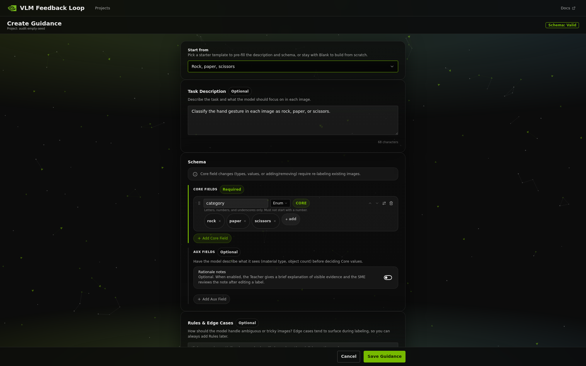

# NVIDIA AI Blueprint: Interactive VLM Feedback Loop

Turn expert corrections into a better vision-labeling loop, measure the
result, fine-tune a smaller Student with NVIDIA TAO, and prepare a validated
deployment handoff.



The core loop is intentionally simple:

1. A Teacher VLM proposes a structured label for an image.
2. A Subject Matter Expert (SME) accepts it, corrects it, or skips the image.
3. Accepted and corrected labels become Verified ground truth.
4. Corrected examples can guide later Teacher requests through In-Context
   Learning (ICL).
5. Held-out evaluation measures progress and a readiness gate controls Batch
   Labeling.
6. Optional NVIDIA TAO jobs fine-tune, evaluate, and quantize Student models;
   NVIDIA NIM then supports serving validation and benchmarking.

ICL changes the examples placed in later prompts; it does **not** change the
Teacher's weights. Student fine-tuning is the weight-updating stage.

> [!WARNING]
> This is a single-user reference application with **no authentication,
> authorization, or multi-user isolation**. It binds to `127.0.0.1` by
> default. Do not expose it directly to the public internet. Remote access
> requires a trusted network and an operator-managed authenticated proxy or
> equivalent access-control layer.

## Choose your path

| You are… | Start here |
|---|---|
| An SME evaluating the labeling loop | [10-minute hosted quick start](#10-minute-hosted-quick-start) |
| A developer changing the Blueprint | [Local source mode](#local-source-mode) |
| A GPU/NIM operator | [Deployment guide](docs/deployment.md) and [local NIM setup](docs/local_nim_dev_setup.md) |
| A TAO infrastructure operator | [TAO FTMS operator guide](docs/tao-ftms-install.md) |

## 10-minute hosted quick start

This is the recommended first experience. It uses Docker Compose, a hosted
NVIDIA API endpoint, and the bundled 15-image rock/paper/scissors sample. No
local GPU is required.

### Supported systems

- **Containerized mode:** Linux with Docker Engine + Compose v2, or Docker
  Desktop on macOS/Windows, using hosted NVIDIA endpoints.
- **Local source mode:** validated on Ubuntu 22.04 LTS with Python 3.11–3.13,
  Node.js 20+, `uv`, and `pnpm` 9+.
- **System-managed local NIM:** Linux only, with Docker Engine, NVIDIA
  Container Toolkit, an NGC key, and a supported NVIDIA GPU.

### 1. Launch

Get an API key from
[build.nvidia.com](https://build.nvidia.com/settings/api-keys), then:

```bash
git clone https://github.com/zerodefects/vlm-feedback-loop-public.git
cd vlm-feedback-loop-public
export NVIDIA_API_KEY=nvapi-...
docker compose up --build
```

Open <http://localhost:3000>. The nginx edge is published only on
`127.0.0.1` unless an operator deliberately changes `EDGE_BIND_HOST`.

### 2. Create a project

Select **Create Project**, give the project a name, and follow the setup
screens. Keep the recommended hosted Teacher and hosted embedding provider for
this walkthrough. A key pasted in the Compose UI applies only for the current
backend process; put a persistent key in the repository-root `.env` or your
deployment secret manager.

### 3. Ingest the bundled sample

On **Ingest Images**, select **Use bundled sample**. Container mode opens
`/data/images`; source mode opens the checkout's
`deploy/example-images/` directory. Select all 15 images and choose
**Ingest Selected**.

This sample is a walkthrough/smoke dataset. It is intentionally too small to
pass the default Scale-Up gate.

### 4. Apply rock-paper-scissors Guidance

Open **Guidance**, select the **Rock, paper, scissors** preset, and apply it.
The preset asks the Teacher to classify the visible hand gesture and defines
one Core enum:

```json
{
  "category": "rock | paper | scissors"
}
```

Activate the saved Guidance version, then open **Labeling**.

### 5. Create Verified labels

For each proposal:

- If the category is correct, choose **Save**. The result is a Verified
  Accept.
- If the category is genuinely wrong, change it to the category visible in
  the image and choose **Save**. The result is a Verified Edit.
- If the image cannot be judged, choose **Skip**.

Never manufacture an incorrect label just to exercise Edit. When a real
correction occurs, that Verified Edit becomes eligible for later ICL requests
unless it is reserved for the Test Pool. The next proposal may therefore
receive the corrected image and Core label as an example.

### 6. Understand the scale boundary

The sample demonstrates the product loop but cannot establish meaningful model
quality. For the default 40% Test Pool allocation to reach its 60-image
minimum, ingest and review **at least 150 images**, and all 150 must become
Verified. Real model-quality requirements depend on the domain, class balance,
error cost, and image variability; they may be much higher.

Continue with your own dataset, run evaluation, and use **Scale Up** to see the
five readiness criteria. Batch Labeling remains disabled until the gate passes.
Student Training uses its own authoritative TAO and data preflight.

### Stop, restart, and reset

Stop while preserving project data:

```bash
docker compose down
```

Resume later with `docker compose up --build`. Projects persist in the Docker
named volume `vlm-feedback-loop-workspace`; images are referenced from the
configured image mount and are not copied into the project.

> [!CAUTION]
> The following reset permanently deletes **all Compose-mode projects,
> databases, exports, artifacts, and logs** in the named workspace volume.
> Stop the stack and verify the exact volume name first.

```bash
docker compose down
docker volume rm vlm-feedback-loop-workspace
```

See the [deployment guide](docs/deployment.md) for bind-mounted workspaces,
trusted-network binding, logs, and narrower source-mode reset instructions.

## Local source mode

Use this path for development or for system-managed local NIM containers.

```bash
git clone https://github.com/zerodefects/vlm-feedback-loop-public.git
cd vlm-feedback-loop-public
uv sync
cd src/ui && pnpm install && cd ../..
uv run vlm-feedback-loop init --workspace-root ~/vlm-workspace
# Add NVIDIA_API_KEY to ~/.vlm_feedback_loop/.env for hosted endpoints.
./scripts/dev.sh
```

Open <http://localhost:5173>. The backend runs at
<http://localhost:8000>; Vite proxies REST and SSE requests.

The **Use bundled sample** action opens
`deploy/example-images/` directly—there is no need to navigate from `/`.
Source-mode project data persists under
`{WORKSPACE_ROOT}/projects/{project_id}/`. Stop with `Ctrl+C` and rerun
`./scripts/dev.sh` to resume.

For a non-loopback source bind, set one absolute `IMAGE_ROOT` and place an
authenticated access-control layer in front of the application. Filesystem
operations fail closed when a non-loopback backend has no image root.

## What the Blueprint includes

- React 19 + TypeScript + Vite UI using KUI Foundations and Tailwind 4.
- Python + FastAPI backend as the authority for validation, prompt
  construction, ICL selection, evaluation, readiness, and run state.
- One SQLite database per project, in WAL mode, with automatic Alembic
  migrations.
- Inline pHash plus hosted or local NeMo Retriever VL embeddings for diverse
  review order and relevance-ranked ICL.
- Hosted or local NVIDIA NIM Teacher inference.
- Background evaluation, Batch Labeling, dataset export, TAO training chains,
  Student registration, serving validation, and comparison.
- In-process asyncio jobs; no external task queue.


Runtime data is outside the repository:

```text
{WORKSPACE_ROOT}/
  projects/
    {project_id}/
      project.db
      exports/
      artifacts/
      logs/
```

Images remain at their source paths and are stored by reference.

## Scale-Up and training safety

The **Scale-Up Readiness Gate** controls Batch Labeling from evaluation
quality, per-value F1, recent Accept rate, and Test Pool coverage. Auto-Labeled
outputs are synthetic and are never represented as Verified ground truth.

Student Training is separately preflighted. The first-run
**Validate training setup** workflow selects:

- one recommended small Student base;
- the Quick preset;
- the full-precision baseline plus `FP8_DYNAMIC`; and
- exactly four TAO jobs: train, baseline evaluate, quantize, and FP8 evaluate.

Before submission, the UI shows backend-authoritative Verified training,
held-out Test Pool, eligible Auto-Labeled, excluded, and final usable counts.
It then requires confirmation of the models, resolved preset, variants, exact
job count, dataset counts, and remote-infrastructure warning.

Use the explicit **Compare candidate variants** workflow only when the
additional model and quantization cost is intended. A successful tiny-data
validation confirms the TAO wiring; it is not a production-quality model.

TAO setup is deployment-level infrastructure. SMEs can copy a structured
**Request TAO setup** Action Request; operators use the
[TAO FTMS guide](docs/tao-ftms-install.md) to install, validate, and bootstrap
the shared workspace.

## Serving validation and production handoff

The Blueprint distinguishes three stages:

- **Quality validation:** TAO predictions are re-scored over the frozen,
  Verified-only Test Pool with the Blueprint's canonical Core-field evaluator.
- **Serving validation:** a Student runs temporarily behind NIM to measure
  latency, throughput, runtime health, and serving configuration.
- **Production deployment:** an external infrastructure team owns the
  permanent service, access controls, scaling, monitoring, and operations.

The Blueprint does not own a permanent production service. When a Student has
both quality and serving validation, **Request production deployment**
generates a handoff containing:

- checkpoint and checksum references;
- base model, quantization, NIM release/profile, tensor parallelism, and
  required environment configuration;
- evaluation metrics, Test Pool snapshot, Guidance, and ICL mode;
- latency/throughput evidence; and
- training, quantization, dataset, and provenance lineage.

If local serving validation cannot start, **Deploy for serving validation**
generates a separate temporary-infrastructure request. It is not a production
handoff.

## Configuration

Configuration has three scopes:

1. `~/.vlm_feedback_loop/config.yaml` — non-secret settings such as
   `WORKSPACE_ROOT`, `IMAGE_ROOT`, ports, log level, model defaults, embedding
   settings, and `ALLOW_UI_SECRET_PERSIST`.
2. `~/.vlm_feedback_loop/.env` — source-mode deployment secrets.
3. Shell or repository-root `.env` — Compose interpolation and secrets.

See [`config.yaml.example`](config.yaml.example) and
[`.env.example`](.env.example). Important credentials:

| Variable | Used for |
|---|---|
| `NVIDIA_API_KEY` | Hosted Teacher and hosted image embeddings |
| `NGC_API_KEY` | Local NIM image pulls and weight access |
| `HF_TOKEN` | Gated Student-base access when required |
| `TAO_API_BASE_URL`, `TAO_ORG_NAME`, `TAO_API_KEY` | TAO FTMS |
| `TAO_WORKSPACE_S3_ACCESS_KEY`, `TAO_WORKSPACE_S3_SECRET_KEY` | TAO workspace transfer |

Compose binds nginx with
`${EDGE_BIND_HOST:-127.0.0.1}:${EDGE_PORT:-3000}` and mounts the bundled
sample when `IMAGE_ROOT` is unset. It deliberately has no Docker socket, so
system-managed local NIM orchestration requires local-source mode.

## Local GPU and NIM operators

The backend can launch local Teacher, embedding, and temporary Student NIM
containers in source mode. One NIM container is permitted per GPU. Placement,
replacement confirmation, cache persistence, supported models, GPU floors,
registry authentication, served-model verification, and prompt image limits
are documented in:

- [Deployment guide: GPU and local NIM behavior](docs/deployment.md#gpu--local-nim-runtime-behavior)
- [Local NIM development setup](docs/local_nim_dev_setup.md)

Do not add the Docker socket to the Compose backend; that is outside the
shipped security boundary.

## Development and validation

```bash
uv run pytest tests/unit/ -q
uv run pytest tests/integration/ -q -n 0
uv run ruff check .
uv run ruff format --check .
uv run pyright src/backend/

cd src/ui
pnpm test
pnpm typecheck
pnpm lint
pnpm build
```

Integration tests are serial because they launch services on fixed ports.
See [`docs/AdvancedTests.md`](docs/AdvancedTests.md) for live validation and
test infrastructure.

## Documentation

| Document | Purpose |
|---|---|
| [`docs/Overview.md`](docs/Overview.md) | Product concepts and workflows |
| [`docs/API.md`](docs/API.md) | Curated consumer API |
| [`docs/deployment.md`](docs/deployment.md) | Container, source, persistence, networking, and GPU operation |
| [`docs/tao-ftms-install.md`](docs/tao-ftms-install.md) | TAO operator install, health validation, and Blueprint bootstrap |
| [`docs/local_nim_dev_setup.md`](docs/local_nim_dev_setup.md) | Local NIM operator setup |
| [`docs/Engineering_Spec_Brief.md`](docs/Engineering_Spec_Brief.md) | Cross-cutting normative-contract map |
| [`docs/Engineering_Spec.md`](docs/Engineering_Spec.md) | Authoritative implementation contract |
| [`docs/changelog.md`](docs/changelog.md) | Public release history |

## Repository layout

```text
vlm-feedback-loop/
  deploy/             Bundled sample images and data license
  docs/               Public product and operator documentation
  scripts/            Setup, validation, and developer utilities
  src/backend/        FastAPI application
  src/ui/             React application
  tests/unit/         Backend unit tests
  tests/integration/  Serial live-service tests
  docker-compose.yml  nginx + backend + UI
```

## License

Application source is governed by the [Apache License 2.0](LICENSE).
Third-party software and model terms remain separate; review
[`LICENSE-3rd-party.txt`](LICENSE-3rd-party.txt) before use.

The bundled sample under [`deploy/example-images/`](deploy/example-images/) is
CC BY 2.0 and includes its own
[`LICENSE.DATA`](deploy/example-images/LICENSE.DATA).

Hosted and local models are governed by their respective NVIDIA API Catalog,
NGC, or third-party terms.
